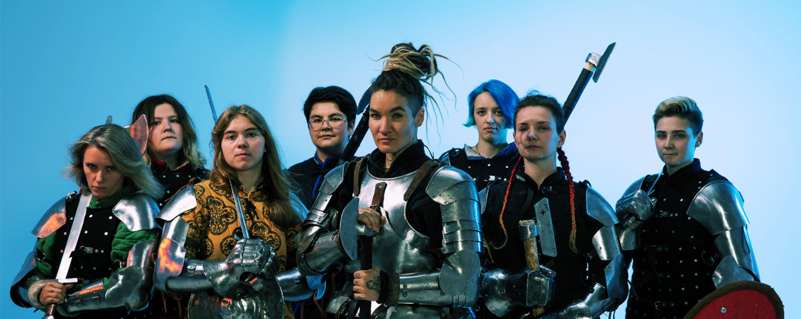

# Alphyn HMB team

This is list of achievements of "Alphyn" — female team fighting in [historical medieval battle](https://en.wikipedia.org/wiki/Historical_Medieval_Battles) tournaments.

I think we are pretty cool here. I'm the one with glasses.

Here are our social media links (all in Russian):
- [VK: alphyn_spb](https://vk.com/alphyn_spb)
- [Instagram: @alphyn.spb](https://instagram.com/alphyn.spb)

We are based in St. Petersburg, Russia.

## How to run
Open [alphyn.team](https://alphyn.team/) to see our team resume.

If you want to run it locally, clone the repository and open `index.html` in your browser.

## How I made it
At first it was Google Sheets table with tournament data that I gathered.

Then I exported it to HTML and adapted it to to various screen sizes and orientations, and for print.

Now I update the information when our team participates in new tournaments.

## What's next
I'm pretty happy with the result, but here some ideas for improvement.

1. Showcase when our girls were selected as the best female fighters of the tournament.

    For example, this title was awarded to:
    - [Elizaveta Trosheva at Steel Bear 2023](https://vk.com/wall-109532566_4145)
    - [Anastasia Plyuta at The Best Five 2022](https://vk.com/wall-109532566_3790)

      Sad fact: that was my last tournament, I'm not fighting HMB anymore.

2. Eliminate dependency on Google Fonts.

    I learned more about cross-site tracking at [Learn Privacy course by Stuart Langridge](https://web.dev/learn/privacy/third-parties/), and realized that even fonts can be used for tracking.

    I think about using [local fonts](https://css-tricks.com/snippets/css/using-font-face/) instead. One possible source of fonts is [Fontspring](https://www.fontspring.com/about).

    I downloaded free font with web license for unlimited pageviews/month from there before.

    Here is sample search query for [free serif fonts with support for Russian language](https://www.fontspring.com/search?filter%5Bfree%5D=free&filter%5Blanguages%5D%5B0%5D=russian&filter%5Btags%5D%5B0%5D=serif).

3. Showcase tournament photos and videos? I'm not sure about this one — it doesn't fit the resume format. Any practical ideas are welcome.

4. Showcase individual achievements of our fighters from duelling tournaments? I'm not sure about this one either. 
  
    For now I think it's better to keep it simple and focused on team achievements, but I'm open to suggestions.
